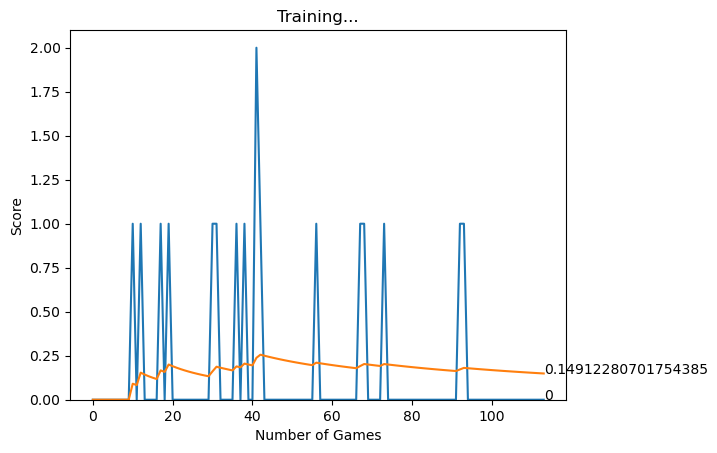
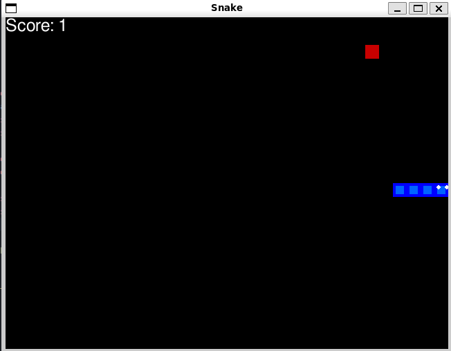

# Snake Game solution by RL way


This project presents a solution to the classic Snake Game using Reinforcement Learning (RL) with the Q-learning algorithm and a deep neural network. The goal is to train an agent to play the game effectively, maximizing its score by collecting food while avoiding collisions with itself or the grid boundaries.

The core of the project involves implementing a Q-learning agent, which utilizes a deep neural network called `Linear_QNet`, to approximate the Q-values of different state-action pairs. The agent interacts with the game environment, stores its experiences in a replay memory, and updates its Q-network using experience replay and the Bellman equation.

This README provides an overview of the implementation, including details about the `AGENT` class, state representation, experience replay, training process, and action selection. Additionally, it covers the setup requirements and dependencies for running the Snake Game with the RL-based agent.


--------------
## **Project: Q-Learning with Deep Neural Networks**

### **Introduction**

This project implements a Q-learning algorithm with a deep neural network using PyTorch. The agent learns to play the Snake game by interacting with the environment and updating its Q-values based on the rewards received. The Q-values are estimated using a deep neural network called `Linear_QNet`.

### **Implementation**

#### **1. Agent Class - `AGENT`**

The `AGENT` class represents the Q-learning agent. It has the following components:

- `number_of_games`: Number of games played by the agent.
- `epsilon`: Exploration rate for choosing random actions.
- `GAMMA`: Discount factor for future rewards.
- `memory`: Replay memory to store experience tuples.
- `model`: The Q-network model (`Linear_QNet`) used by the agent.
- `trainer`: The Q-training object (`QTraining`) to train the model.
- `last_move`: The last move made by the agent.

#### **2. State Representation - `get_state`**

The `get_state` method takes the game state as input and converts it into a numerical representation. It creates an 11-dimensional state vector that represents various features of the game state, such as danger zones, current direction, and food location.

#### **3. Experience Replay - `remember_brain`**

The `remember_brain` method stores the experience tuple `(state, action, reward, next_state, is_done)` into the agent's replay memory.

#### **4. Training - `train_long_memory` and `train_short_memory`**

The `train_long_memory` method performs a batch training step using experience replay. It samples a mini-batch of experiences from the replay memory and updates the Q-network's weights using the Q-training object's `train_step` method.

The `train_short_memory` method performs a single training step using the current experience tuple. It updates the Q-network's weights without using experience replay.

#### **5. Action Selection - `action_state`**

The `action_state` method selects an action to take based on the current state. It implements an epsilon-greedy strategy, where there is a chance of choosing a random action (exploration) and a chance of choosing the action with the highest Q-value (exploitation) predicted by the Q-network.

#### **6. Training Loop - `train`**

The `train` function is the main training loop. It initializes the game environment, creates an instance of the agent, and iteratively plays the game, collects experiences, and performs training steps. It also keeps track of the game scores, updates the best score, and plots the training progress using Matplotlib.

--------
## **Project: Q-Learning with Deep Neural Networks**

### **Introduction**

This project implements a Q-learning algorithm with a deep neural network using PyTorch. The main goal is to train an agent to make decisions in an environment with discrete actions and states. The deep neural network is used as a function approximator to learn the Q-values of different state-action pairs.

### **Requirements**

Before running the code, make sure you have the following libraries installed:

- Python 3.x
- PyTorch (version >= 1.0)
- NumPy
 
### **Implementation**

#### **1. Neural Network Model - `Linear_QNet`**

The `Linear_QNet` class defines a simple feedforward neural network with three linear layers. The constructor takes the input size, two hidden layer sizes, and output size as arguments. The network architecture is as follows:

- Input Layer: `input_size` neurons
- Hidden Layer 1: `hidden_1_size` neurons, activated by ReLU activation function
- Hidden Layer 2: `hidden_2_size` neurons, no activation function
- Output Layer: `output_size` neurons, representing Q-values for each action

The `forward` method defines the forward pass of the network, where the input `x` is passed through the linear layers with ReLU activation in between Hidden Layer 1 and Hidden Layer 2.

#### **2. Model Saving and Loading**

The `save` method saves the model's state dictionary to a file named "model.pth" in the "./model" directory. If the directory doesn't exist, it is created first.

The `save_checkpoint` method saves the model's state dictionary using a checkpoint format to a file named "checkpoint.pth" in the "./model" directory.

The `load_checkpoint` method loads a saved checkpoint from the file "checkpoint.pth" in the "./model" directory. It retrieves the state dictionary and loads it into the model.

#### **3. Q-Training - `QTraining`**

The `QTraining` class is responsible for training the Q-network using Q-learning. It takes the model, learning rate (`lr`), and discount factor (`gamma`) as arguments during initialization.

The `train_step` method performs a single training step for the Q-network. It takes a tuple of `(state, action, reward, next_state, done)` as input, where:
- `state`: The current state of the environment
- `action`: The action taken by the agent
- `reward`: The reward received after taking the action
- `next_state`: The next state of the environment after taking the action
- `done`: A flag indicating whether the episode is finished

The method calculates the Q-value target using the Bellman equation, updates the Q-values of the chosen actions, and performs backpropagation to minimize the Mean Squared Error (MSE) loss between the predicted Q-values and the target Q-values.

### **Training**

To train the Q-network, follow these steps:

1. Create an instance of the `Linear_QNet` class with the appropriate input, hidden, and output sizes.
2. Create an instance of the `QTraining` class, passing the model, learning rate, and discount factor.
3. Run multiple episodes of the environment and train the model at each step using the `train_step` method.


--------------
## **Snake Game**

This is a simple implementation of the classic Snake Game using Python and the Pygame library.

### **Game Functionality**

The Snake Game offers the following functionality:

- The snake moves on a grid and the player controls its direction.
- The objective is to eat the food that appears randomly on the grid.
- As the snake eats food, it grows longer.
- The game ends if the snake collides with itself or with the boundaries of the grid.
- The score increases each time the snake eats food.
- The game speed gradually increases as the player scores more points.

### **Instructions**

To run the Snake Game, ensure that you have Python and Pygame installed on your system. Then, execute the Python script **`snakeAI.py`** for AI version or **`snakehuman.py`** for playable version.

```⚠️ updates on the way to make it more playable ⚠️```

Controls:
- Use the arrow keys (up, down, left, right) to change the direction of the snake.
- Press the spacebar to pause or resume the game.

### **Dependencies**

The Snake Game requires the following dependencies:
- Python 3.x
- Pygame 


## **Output and Improvement requirements**

<p float="left">
    
    
</p>

Sometimes the AI just starts to keep going in circles, one way to fix it is giving it a penalty for going back to the same position it was before, but it will take more time to train. 

## **Any other ideas are welcome.**
